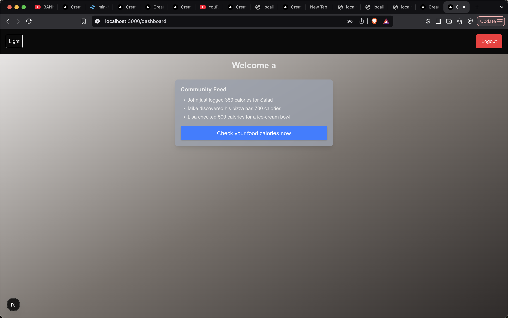

# Meal Calorie Frontend (Asif Parvez)

This project is a Next.js application that provides a front end for the Meal Calorie Count Generator backend.
It was bootstrapped using `create-next-app` with the App Router and Tailwind CSS.

## Getting Started

1. Install dependencies using **npm** (recommended).
   ```npm install```
2. Copy `.env.example` to `.env` and update values if needed. The sample file
   points to the built-in API routes under `/api`.
3. Run the development server:
   ```npm run dev```
   The app should be available at [http://localhost:3000](http://localhost:3000).
   Visiting `/` now redirects to the calorie search page if you are
   authenticated. Otherwise you'll see options to log in or register.
   Use the **Logout** button in the header to clear your session and return to the landing page.
   Every page also includes a simple footer with the app name and year.

## Decisions / Trade-offs
- Uses Next.js App Router with TypeScript and Tailwind CSS.
- Zustand is used for auth and meal state management.
- A simple mock backend is implemented using Next.js API routes.
  The API base URL can be configured via environment variables.

## Screenshots





## Deployment
This app is deployed to Vercel: [https://meal-calorie-frontend-asif-parvez-b35x9dmma-proasifs-projects.vercel.app/](https://meal-calorie-frontend-asif-parvez.vercel.app/)

## Testing
- `npm test` runs unit tests with Vitest.
- `npm run test:e2e` runs Playwright end-to-end tests (requires browsers via `npx playwright install`).
